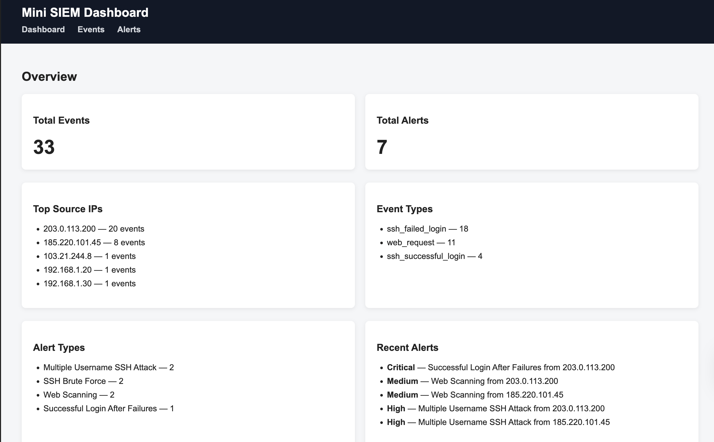
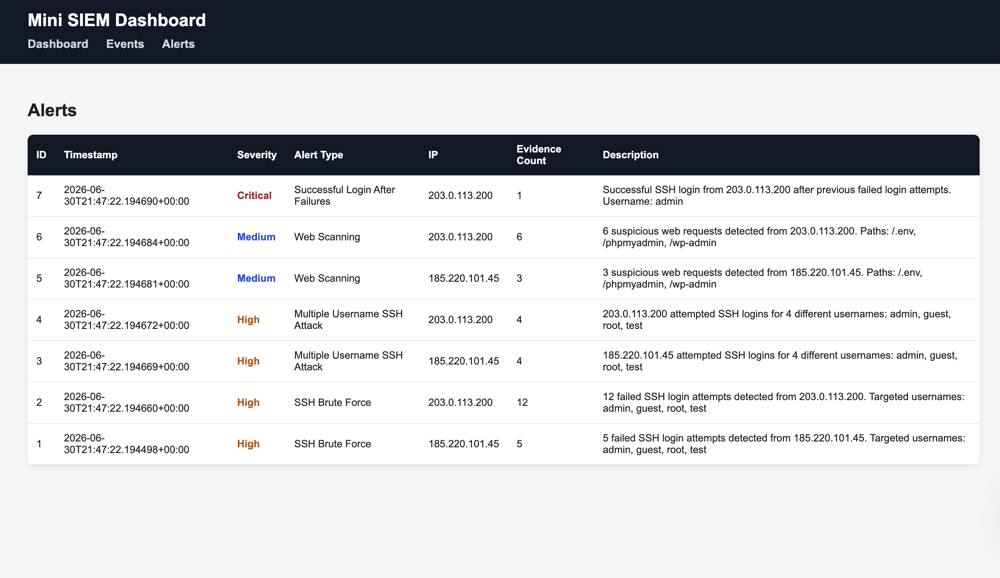
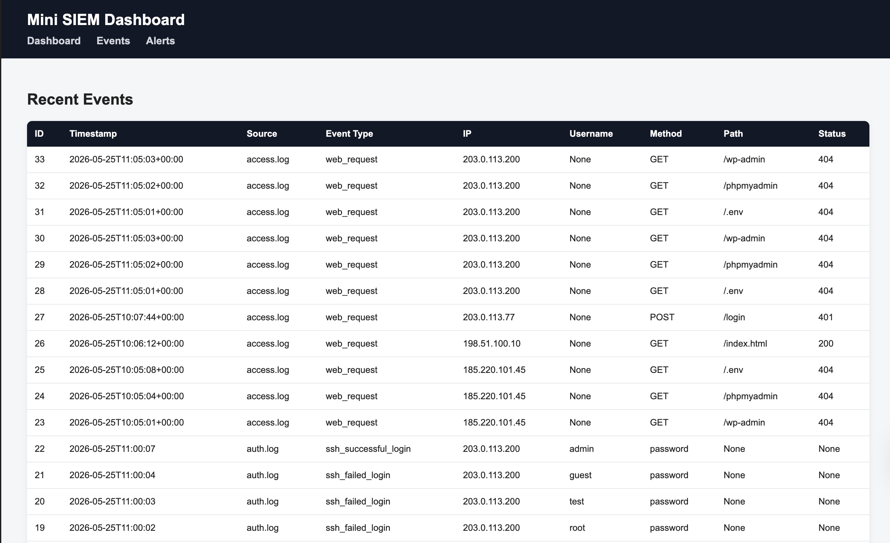
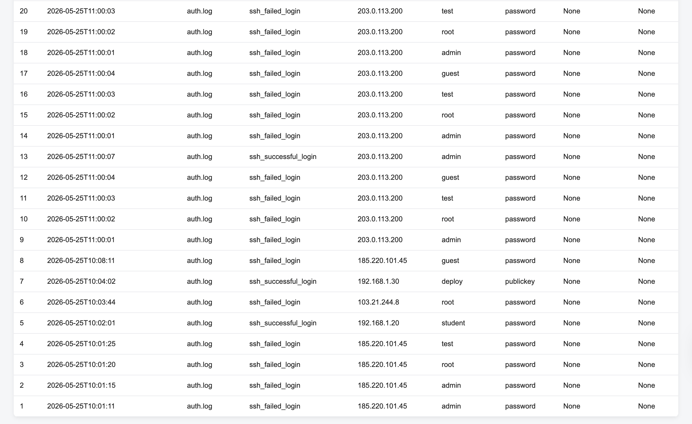

# Mini SIEM Security Dashboard

A lightweight real-time Security Information and Event Management project built with Python, Flask, and SQLite.

This project parses Linux SSH authentication logs and web server access logs, stores structured security events, runs rule-based detection logic, and displays alerts through a Flask dashboard.

## Features

- Parses Linux SSH authentication logs
- Parses Apache/Nginx-style web access logs
- Stores structured events in SQLite
- Detects SSH brute-force attempts
- Detects multiple-username login attempts
- Detects successful SSH login after previous failures
- Detects suspicious web scanning activity
- Supports real-time log monitoring
- Provides an auto-refreshing Flask dashboard
- Displays total events, alert counts, top source IPs, event types, and recent alerts

## Architecture

```text
sample_auth.log / sample_access.log
        ↓
monitor.py
        ↓
parser.py
        ↓
detector.py
        ↓
SQLite database
        ↓
Flask dashboard
```

## Screenshots

### Dashboard



### Alerts



### Real-Time Monitor


